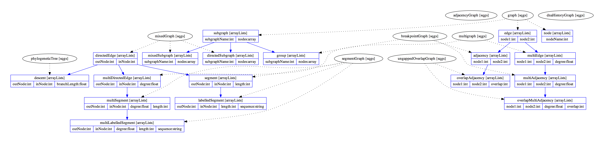

Hierarchy of Types
==================

The following graph illustrates the current ArrayList types and their relationships
to the various graphs defined in the hierarchy.

The following gives the SQG definitions of the different graphs currently included in the hierarchy.
This is extremely tentative and subject to change.

.. toctree::

   include/graph
   include/mixedGraph
   include/multigraph
   include/phylogeneticTree
   include/segmentGraph
   include/breakpointGraph
   include/adjacencyGraph
   include/dnaHistoryGraph
   include/ungappedOverlapGraph

  