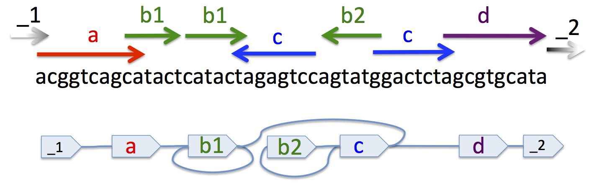

Quick Tutorial
==============

Overview
--------

In this tutorial we will go through the process of constructing an SQG file.
The example will build a graph derived from Richard Durbin's original SQG example. 
The graph represents an assembly problem and is shown 
in the following diagram:

The top of the diagram shows subsequences, termed *segments* aligned to an underlying sequence.
The lower diagram shows an *overlap graph* of the segments and their overlaps, which we
term *adjacencies*.

The Sqg Class
-------------

To construct the containing SQG object we start by importing the ``Sqg`` class and creating
an instance of the class: 

>>> from pysqg.sqg import Sqg
>>> sqg = Sqg(includes=[ "ungappedOverlapGraph" ], \
... sharedVariables={ "Created":"Assemblathon File Format Working Group using \
Richard Durbin's example", "Date":"24/11/2011"})

Both arguments passed to the ``Sqg`` constructor are optional. 

The ``includes=[ "ungappedOverlapGraph" ]`` argument takes a list of graph *types*. 
Like in the C programming
language they are used to load pre-existing SQG files that contain definitions of graph 
types.
For a full list of these graphs see the following chapters. In this case we use the *ungappedOverlapGraph* type,
which defines an appropriate graph type for this example.

The *sharedVariables* argument is simply a python dictionary object (hash) used 
to describe properties of the graph. Here we have simply added date and creation attributes.

The ArrayList Class
-------------------

Nodes, edges and subgraphs, the basic structures described by SQG, are 
represented as lists of typed arrays. ArrayLists use an inheritance mechanism
to allow complex types to be defined hierarchically.

We start by illustrating the building of a list of nodes:

>>> from pysqg.arrayList import InMemoryArrayList
>>> nodes = InMemoryArrayList(type="node")
>>> sqg.setArrayList(nodes)

The basic ``ArrayList`` class is defined in the ``pysqg.arrayList.AbstractArrayList``
class. This class is abstract, but inherited ArrayLists, here the ``InMemoryArrayList``,
allow ArrayLists with specific storage properties. As you might expect, the ``InMemoryArrayList`` used
here stores the information it contains in memory.

The ``type="node"`` argument, which is required, is used to define the type of the
``ArrayList``. The ``nodes`` object is added to the ``sqg`` object by the ``setArrayList`` function.
Only one type of a given ``ArrayList`` is allowed per ``Sqg`` object.

The list can be retrieved from the ``Sqg`` object by the following:

>>> sqg.getArrayList("node")
<pysqg.arrayList.InMemoryArrayList instance at 0x1086aa7e8>

As you might expect, each node in ``nodes`` is represented by an array with a single variable, which is 
assumed to be an integer. To discover this information use can interrogate the ``nodes`` ``ArrayList``. For example:

>>> nodes.getArrayNames()
('nodeName',)

Gets in order the names of the variables in the ``ArrayList``. While:

>>> nodes.getArrayTypes()
('int',)

Gets in order the types of the variables in the ``ArrayList``.

To start to populate the graph we create the two *stub* nodes *_1* and *_2* in the example, which
represent boundaries of the graph and are often convenient, for example, to represent
telomeres or, more generally, missing information.

To add *_1* we can use the ``addArray`` function:

>>> _1 = 0
>>> nodes.addArray([ _1 ])

Which takes an array of variables whose types must match those of the variables in the ``ArrayList``.

Alternatively, we can use the ``addDict`` function:

>>> _2 = 1
>>> nodes.addDict({ "nodeName":_2 })

Which takes a dictionary object (hash) of *key:value* pairs which are used to define the variables in the array.

Edges as more complex ArrayLists
--------------------------------

The process of adding edges and more complex types to the graph follows exactly
the same process as the nodes.

Segment Edges
+++++++++++++++

We start by adding the edges representing the segments (subsequences) to the graph.

>>> from pysqg.arrayList import OnDiskArrayList
>>> segmentEdges = OnDiskArrayList(file="./segmentEdges", type="multiLabelledSegment")
>>> sqg.setArrayList(segmentEdges)

The above fragment loads the ``OnDiskArrayList`` class, which stores the arrays it
contains on disk, and therefore is suitable where the number of edges is too large to fit
into memory. The ``file="./segmentEdges"`` required argument specifies the file
to store the arrayList's contents in. 

This time the ``type="multiLabelledSegment"`` argument
specifies the use of a more complex ArrayList type representing a segment edge. Again,
we use the ``getArrayNames`` and ``getArrayTypes`` functions to interrogate the object's
variables:

>>> segmentEdges.getArrayNames()
('outNode', 'inNode', 'degree', 'length', 'sequence')
>>> segmentEdges.getArrayTypes()
('int', 'int', 'float', 'int', 'string')

You can see that this edge type has an out- and and an in-node, as it is a type of directed edge.

Additionally, it has a degree variable, representing the number of times it occurs in the underlying sequence, a 
length variable, representing the length of the sequence it represents and an actual sequence, which is stored as a string.

We can now proceed to add the segment edges to the graph:

The *a* segment:

>>> aL, aR = 2, 3
>>> nodes.addArray([ aL ])
>>> nodes.addArray([ aR ])
>>> segmentEdges.addDict({ "inNode":aL, "outNode":aR, "length":10, \
... "sequence":"acggtcagca", "degree":1 })

In the above fragment we:
	* define the nodes for the edge,
	* add the two nodes to the ``nodes`` array,
	* and create a segment edge, in this case of length 10, with the sequence "acggtcagca" and which occurs only once in the underlying sequence.

The remainder of the segment edges are added similarly.

The *b1* segment:

>>> b1L, b1R = 4, 5
>>> nodes.addArray([ b1L ])
>>> nodes.addArray([ b1R ])
>>> segmentEdges.addDict({ "inNode":b1L, "outNode":b1R, "length":6, \
... "sequence":"catact", "degree":2 })

The *b2* segment:

>>> b2L, b2R = 6, 7
>>> nodes.addArray([ b2L ])
>>> nodes.addArray([ b2R ])
>>> segmentEdges.addDict({ "inNode":b2L, "outNode":b2R, "length":6, \
... "sequence":"cgtact", "degree":1 })

The *c* segment:

>>> cL, cR = 8, 9
>>> nodes.addArray([ cL ])
>>> nodes.addArray([ cR ])
>>> segmentEdges.addDict({ "inNode":cL, "outNode":cR, "length":8, \
... "sequence":"ggactcta", "degree":2 })

And finally the *d* segment:

>>> dL, dR = 10, 11
>>> nodes.addArray([ dL ])
>>> nodes.addArray([ dR ])
>>> segmentEdges.addDict({ "inNode":dL, "outNode":dR, "length":10, \
... "sequence":"agcgtgcata", "degree":1 })

Adjacency Edges
+++++++++++++++

The other edges in the graph represent the *adjacencies*, the connections between
the ends of the segments. 

>>> adjacencyEdges = OnDiskArrayList(file="./adjacencyEdges", type="overlapAdjacency")
>>> sqg.setArrayList(adjacencyEdges)

Here they are allowed to overlap, hence we use the 
``overlapAdjacency`` type. The variable's of the array are shown below.

>>> adjacencyEdges.getArrayNames()
('node1', 'node2', 'overlap')
>>> adjacencyEdges.getArrayTypes()
('int', 'int', 'int')

This time the edge type is undirected, hence the node variables are not prefixed
with "in" or "out". 

Given this type we can add the adjacencies to the graph.

>>> adjacencyEdges.addDict({ "node1":_1, "node2":aL, "overlap":-1})
>>> adjacencyEdges.addDict({ "node1":aR, "node2":b1L, "overlap":-2})
>>> adjacencyEdges.addDict({ "node1":b1R, "node2":b1L, "overlap":0})
>>> adjacencyEdges.addDict({ "node1":b1R, "node2":cR, "overlap":-1})
>>> adjacencyEdges.addDict({ "node1":cL, "node2":b2R, "overlap":0})
>>> adjacencyEdges.addDict({ "node1":b2L, "node2":cL, "overlap":-1})
>>> adjacencyEdges.addDict({ "node1":cR, "node2":dL, "overlap":-1})
>>> adjacencyEdges.addDict({ "node1":dR, "node2":_2, "overlap":0})

ArrayList objects are purposefully very limited in their abilities, 
being designed as means to store information but not randomly access it. Rather
we choose to make it simple to convert ``Sqg`` instances and their arrayLists into
other formats, for example into databases and more complex in memory and on disk storage
mechanisms that provide such functionality. 

The only means to access the arrays in an arrayList
is to use iterators. For example:

>>> for node1, node2, overlap in adjacencyEdges:
...     print "node1", node1, "node2", node2, "overlap", overlap
... 
node1 0 node2 2 overlap -1
node1 3 node2 4 overlap -2
node1 5 node2 4 overlap 0
node1 5 node2 9 overlap -1
node1 8 node2 7 overlap 0
node1 6 node2 8 overlap -1
node1 9 node2 10 overlap -1
node1 11 node2 1 overlap 0

Shows how it is possible to iterate through the adjacency edges of the ``Sqg``.

Subgraphs
---------

The last major type of ArrayList that we have defined in SQG (so far) represents a subgraph
of an SQG graph. There are several types already defined in the hierarchy, for example:

>>> mixedSubgraphs = InMemoryArrayList(type="mixedSubgraph")

The simplest possible subgraph (as in this example) is represented using a pair of attributes:

>>> mixedSubgraphs.getArrayNames()
('subgraphName', 'nodes')
>>> mixedSubgraphs.getArrayTypes()
('int', 'array')

Firstly a ``subgraphName`` attribute, which is used to identify the subgraph. 
Secondly, and more importantly, an array that must contain the names of the nodes
contained in the subgraph.

By convention, all edges that connect nodes in a given subgraph are considered potentially contained
within the subgraph. To define which types of edges are actually allowed in a subgraph an ``edges`` variable
is placed in the ``sharedVariables`` attribute of the representing ``ArrayList``. 

In this example, as the subgraph is mixed,
allowing for both directed an undirected edges, the ``edges`` attribute is as follows:

>>> mixedSubgraphs.getSharedVariables()
{u'edges': [u'edge', u'directedEdge']}

To illustrate a more interesting example, we create a subgraph representing a path in Richard Durbin's example SQG, 
termed a *walk*.

To do this we must firstly define a slightly extended subgraph type, not currently contained in the SQG type hierarchy:

>>> walks = InMemoryArrayList(type="walk", inherits="mixedSubgraph", \
variables=[ "start", "int", "stop", "int" ], sharedVariables={ "edges":[ "segmentEdge", "adjacencyEdge" ] })

This subgraph allows for segment and adjacency edges and requires for each subgraph integer start and stop variables:

>>> walks.getArrayNames()
('subgraphName', 'nodes', 'start', 'stop')
>>> walks.getArrayTypes()
('int', 'array', 'int', 'int')

These are used to indicate that path, which can be thought of as representing an actual sequence, starts and ends at specific
positions within segments. 

You will note that the addition of these two variables extended the array, being appended after the basic attributes of the inheriting
subgraph type ``mixedSubgraph``.

The two subgraphs defined below illustrate different example *walks* (paths) through the graph:

>>> walks.addDict({ "subgraphName":0, "nodes":\
[ _1, aL, aR, b1L, b1R, b1L, b1R, cR, cL, b2R, b2L, cL, cR, dL, dR, _2 ], "start":0, "stop":0 })
>>> walks.addDict({ "subgraphName":1, "nodes":\
[ aL, aR, b1L, b1R, b1L, b1R, cR, cL, b2L, b2R, cL, cR, dL, dR ], "start":3, "stop":10 })

In the first the the walk starts and ends on stub nodes, without segments and traverses the sequence of segments
*a; b1; b1; -c; -b2; c; d* where the minus sign indicates a traversal through the reverse complement sequence of the segments
forward orientation.

In the second the path starts on the third base of the *a* segment and ends on last position of the *d* segment, 
assuming, for this example, that we use inclusive coordinates and start counting from 1. It also reverse the traversal of b2, 
hence its sequence is  *a; b1; b1; -c; b2; c; d*.
 

Reading and writing SQG files
-----------------------------

To convert the ``sqg`` object into a SQG file we use an associated conversion function:

>>> from pysqg.jsonSqg import makeJsonSqgFromSqg
>>> makeJsonSqgFromSqg(sqg)
{'node': [{'sharedVariables': {}, 'variables': ['nodeName', 'int']}, [0, 1, 2, 3, 4, 5, 6, 7, 8, 9, 10, 11]], \
'multiLabelledSegment': [{'inherits': 'multiSegment', 'sharedVariables': {}, 'variables': \
['inNode', 'int', 'degree', 'float', 'length', 'int', 'sequence', 'string']}, [], './segmentEdges'], \
'overlapAdjacency': [{'inherits': 'adjacency', 'sharedVariables': {}, 'variables': \
['node2', 'int', 'overlap', 'int']}, [], './adjacencyEdges'], 'walk': \
[{'inherits': 'mixedSubgraph', 'sharedVariables': {u'edges': [u'edge', u'directedEdge']}, \
'variables': ['start', 'int', 'stop', 'int']}, [0, [0, 2, 3, 4, 5, 4, 5, 9, 8, 7, 6, 8, 9, 10, 11, 1], \
0, 0, 1, [2, 3, 4, 5, 4, 5, 9, 8, 6, 7, 8, 9, 10, 11], 3, 10]], 'sharedVariables': \
{'Date': '24/11/2011', 'Created': "Assemblathon File Format Working Group using Richard Durbin's example"}, \
'parents': [], 'include': ['ungappedOverlapGraph']}
 
You will notice that the definition of the type of each ArrayList is included in the file.
Shortly this will change, so that the definition is excluded if the type of the ArrayList
can be found in a graph defined in the include hierarchy.

If we want to 'flatten' the sqg to include the on disk arrays (i.e. not have them 
stored in a separate file) then we can:

>>> makeJsonSqgFromSqg(sqg, putOnDiskArraysInJsonSqg=True)
{'node': [{'sharedVariables': {}, 'variables': ['nodeName', 'int']}, [0, 1, 2, 3, 4, 5, 6, 7, 8, 9, 10, 11]], \
'multiLabelledSegment': [{'inherits': 'multiSegment', 'sharedVariables': {}, 'variables': \
['inNode', 'int', 'degree', 'float', 'length', 'int', 'sequence', 'string']}, \
[3, 2, 1.0, 10, 'acggtcagca', 5, 4, 2.0, 6, 'catact', 7, 6, 1.0, 6, 'cgtact', 9, 8, 2.0, 8, 'ggactcta', \
11, 10, 1.0, 10, 'agcgtgcata']], 'overlapAdjacency': [{'inherits': 'adjacency', 'sharedVariables': {}, \
'variables': ['node2', 'int', 'overlap', 'int']}, [0, 2, -1, 3, 4, -2, 5, 4, 0, 5, 9, -1, 8, 7, 0, 6, 8, \
-1, 9, 10, -1, 11, 1, 0]], 'walk': [{'inherits': 'mixedSubgraph', 'sharedVariables': {u'edges': \
[u'edge', u'directedEdge']}, 'variables': ['start', 'int', 'stop', 'int']}, [0, [0, 2, 3, 4, 5, 4, 5, 9, \
8, 7, 6, 8, 9, 10, 11, 1], 0, 0, 1, [2, 3, 4, 5, 4, 5, 9, 8, 6, 7, 8, 9, 10, 11], 3, 10]], 'sharedVariables': \
{'Date': '24/11/2011', 'Created': "Assemblathon File Format Working Group using Richard Durbin's example"},\
 'parents': [], 'include': ['ungappedOverlapGraph']}

To do the reverse, to load an sqg object from an SQG file representation, is also simple.

>>> from pysqg.jsonSqg import makeJsonSqgFromSqg
>>> makeSqgFromJsonSqg(jsonSqg)
<pysqg.sqg.Sqg instance at 0x1086bd7e8>

More convenient functions to write (and read) directly to (and from) SQG files 
are also available.

More Advanced Conversions
-------------------------

As mentioned, our aim is to provide simple conversion from sqg objects to a variety
of different databases, file formats and graph and numerical programming packages.

In the examples chapter you will examples using MongoDB, Numpy and NetworkX and
conversions to and from the FastG and VCF formats.

Hierarchy
---------

SQG gives simple support for the hierarchical organisation of graphs through the use of subgraphs
and the optional ``parents`` variable for an SQG. For example, one graph can be contained in another.

TODO